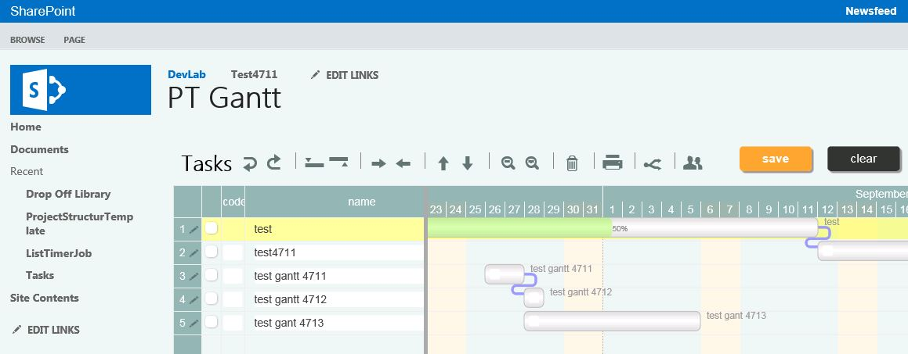

Gantt4Project
===============
This GitHub repo houses all of the content for the Gantt4Project SharePoint ScriptEditorWebPart. 
You are welcome to use this content as you wish.

If you will check only this codeless sandboxed solution on your O365 or SPonPrem you are free to follow this steps:

- Step 0: Goto Site Collection Administration
- Step 1: Upload wsp file from bin to your sitecollection Solutions store
    - you are able to get the wsp from [this repo's bin](Gantt4Project/bin) as RAW file
- Step 2: Activate the solution in your solution store after uploading
- Step 3: Goto Site collection features
- Step 4: Activate the feature named 'Gantt4Project'
    - the feature write some more files in a new folder under /_catalogs/masterpage with name 'Gantt4Project'
    - the feature write a file named 'Gantt4ProjectScript.webpart' in the web part gallery
- Step 5: Goto a page where you will place the web part on
- Step 6: Change the page to Edit Mode
- Step 7: Insert WebPart from Category SuTor named 'Gantt4Project' to the page
    - the web part javascript code will not run in edit mode, so nothing will going on
    - on the first line shown in the script editor, there is set a global var named 'ganttTaskListName' to "Tasks"
        - if you wich to bound to another existing list of type task do it here
- Step 8: Save the page, so the javascript will pull all the items with JSOM from the servers list

 